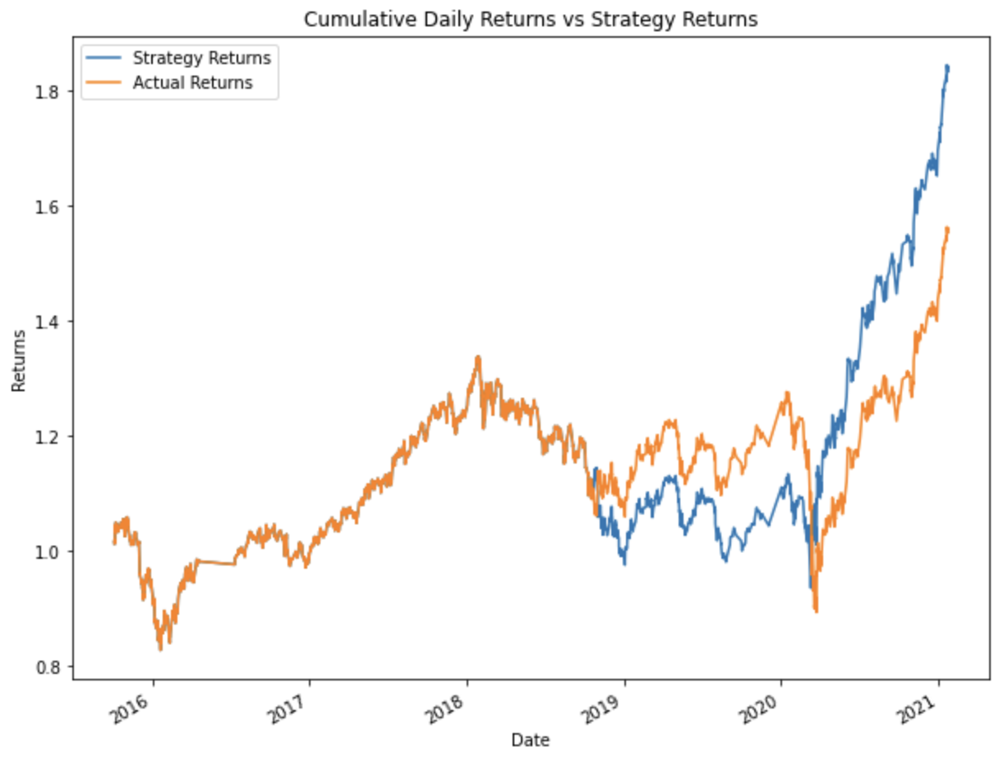

# Machine Learning Trade Bot

This project uses machine learning models to train and evaluate a trade algorithm with the goal of increasing the cumulative returns relative to the actual returns.

---

## Technologies

This project leverages python with the following packages:

* [Pandas](https://github.com/pandas-dev/pandas) - For dataframes, plotting, and DateOffset.

* [Matplotlib](https://github.com/matplotlib/matplotlib) - For pyplot.

* [NumPy](https://github.com/numpy/numpy) - For calculations.

* [Scikit-learn](https://github.com/scikit-learn/scikit-learn) - For SVC and AdaBoostClassifier models, StandardScaler, and classification report.

---

## Installation Guide

Before first running the application install the following dependencies:

```python
    pip install pandas
    pip install numpy
    pip install matplotlib
    pip install scikit-learn
```

Jupyter may be required to view the .ipynb file.

```python
    pip install jupyter
```

---

## Usage

This project was created primarily for viewing and analysis, but can be reused for trading algorithms or model training. Summary as well as code will need to be modified to match any changes, such as new data.

---

## Summary

A total of 4 variations of the code were ran with two different models to determine accuracy measured as cumulative returns across models and adjustments. The initial SVC model was tested once to create a baseline and then twice more with adjusted SMA and training times. In the end, the model with twice as much training time produced the greatest returns, followed by the baseline and finally the SMA adjusted. The results are as follows:

Baseline: 1.517607 - 4 and 100 day SMA with 3 month training:


Training Time: 1.841664 - 4 and 100 day SMA with 6 month training:



SMA Features: 1.320242 - 4 and 50 day SMA with 3 month training:


Increasing the training window had a hugely positive impact on the cumulative returns of the strategy and produced the best strategy out of all the tests. Decreasing the slow SMA to more closely match the fast SMA resulted in a negative impact to the cumulative returns of the strategy.

Finally, a new Ada Boost Classifier model was used and compared against the actual returns again with the following results:

Ada Boost: 0.861650 - 4 and 100 day SMA with 3 month training


This new model performed significantly worse than the previous baseline model and both tuned algorithms. This model is likely not well suited for this strategy as it produced the worst results out of all tests.

---

## Contributors

Brought to you by Majid Kouki. You can reach me at [majidkpy@gmail.com](mailto:majidkpy@gmail.com).

---

## License

[](https://opensource.org/licenses/MIT)